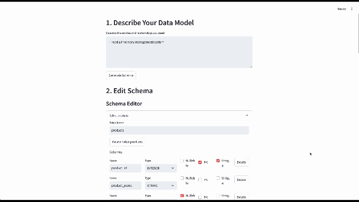

# Visuo Synth : Use LLMs to generate Structured+Unstructured synthetic data



Has a Streamlit-based user interface for generating synthetic data using natural language descriptions. This UI layer sits on top of the core synthetic data generation system and makes it accessible through an intuitive web interface.

## Features

- **Natural Language Input**: Describe your data model in plain English
- **AI-Powered Schema Generation**: Automatically converts descriptions into database schemas
- **Visual Schema Editor**:
    - Add/remove tables and columns
    - Modify data types and constraints
    - Set primary keys and foreign keys
    - Define relationships visually
- **Data Generation Controls**:
    - Specify volume for each table
    - Preview generated data
    - Export to CSV

## Installation

This project uses Poetry for dependency management. The UI component is built on top of the existing synthetic data generation system.

```bash
# Install dependencies
poetry install

# Run the Streamlit app
poetry run streamlit run visuo_synth/ui.py
```

Make sure your `.env` file contains your Google GenAI

```
GOOGLE_API_KEY=<your api key> 
``` 

, OpenAI or 
 
```
OPENAI_API_KEY=<your api key> 
```

Anthropic API key:

```
ANTHROPIC_API_KEY=your_api_key_here
```

## Usage Guide

### 1. Describe Your Data Model
Enter a natural language description of your data needs in the text area. For example:
```
I need a customer management system with customers and their orders. 
Each customer should have a name, email, and registration date. 
Orders should track the amount and creation date.
```

### 2. Generate and Edit Schema
- Click "Generate Schema" to create the initial structure
- Use the visual editor to:
    - Modify table and column names
    - Change data types
    - Set constraints (nullable, unique, etc.)
    - Define relationships

### 3. Generate Data
- Set the number of records for each table
- Click "Generate Data" to create synthetic data
- Preview the generated records
- Find exported CSV files in the `output_data` directory

## Architecture

The UI is built as a thin layer on top of the existing synthetic data generation system:

```
┌─────────────────┐
│  Streamlit UI   │
├─────────────────┤
│ Schema Builder  │
│ Visual Editor   │
│ Data Preview    │
├─────────────────┤
│   Core Logic    │
│ (visuo_synth)   │
└─────────────────┘
```

## Dependencies

- Streamlit for the web interface
- LangChain + Anthropic's Claude for AI capabilities
- Core synthetic data generation system

## Error Handling

The UI provides user-friendly error messages for common issues:
- Invalid schema configurations
- Database constraint violations
- API rate limiting
- File system errors

## Limitations

- The UI currently supports single schema generation at a time
- Schema modifications are limited to basic operations
- Large data volumes may cause longer generation times

## Future Improvements

- [ ] Save/load schema configurations
- [ ] Batch data generation
- [ ] Advanced constraint definitions
- [ ] Custom data type templates
- [ ] Real-time validation feedback
- [ ] Schema version control

## Contributing

1. Check the existing issues or create a new one to discuss your feature idea
2. Fork the repository
3. Create a new branch for your feature
4. Add your changes
5. Submit a pull request

## License

MIT License.
